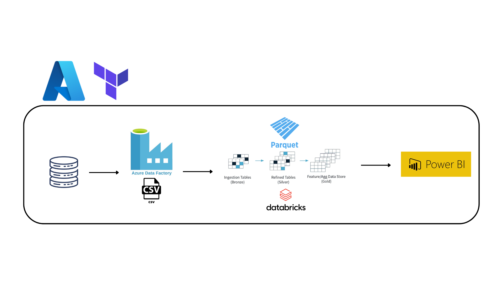

# Data Pipeline completa na Azure com Terraform

### Projeto desenvolvido e discultido no meu blog: 

---

Neste projeto foi criado recursos de um Data Pipeline com Azure utilizando infraestrutura como código com o Terraform. 

A Pipeline é composta pela seguinte arquitetura:

### Visão geral da arquitetura

Partindo como base o consumo da base de dados publica da Olist no Kaggle (https://www.kaggle.com/datasets/olistbr/brazilian-ecommerce), na qual foi carregada no Azure SQL Server Database. Posteriormente foi extraid pelo Data Factory em formato CSV e carregada na camada landing do diretório da Azure Blob Storage (Data Lake Gen 2).

Todo o CSV depositado na camada landing foram tratados e carregados para as outras camadas (processing e curated) no Azure Databricks. No notebook do Databricks é definido primeiramente a montagem do Data Lake (necessário realizar alguns processo de permissões). 

Os dados CSV da camada landing foram transformados para o formato parquet e carregados na camada processing e em seguida foram criadas algumas tabelas especificas para análise na curated zone (consumidas diretamente pelo Power BI).

---
